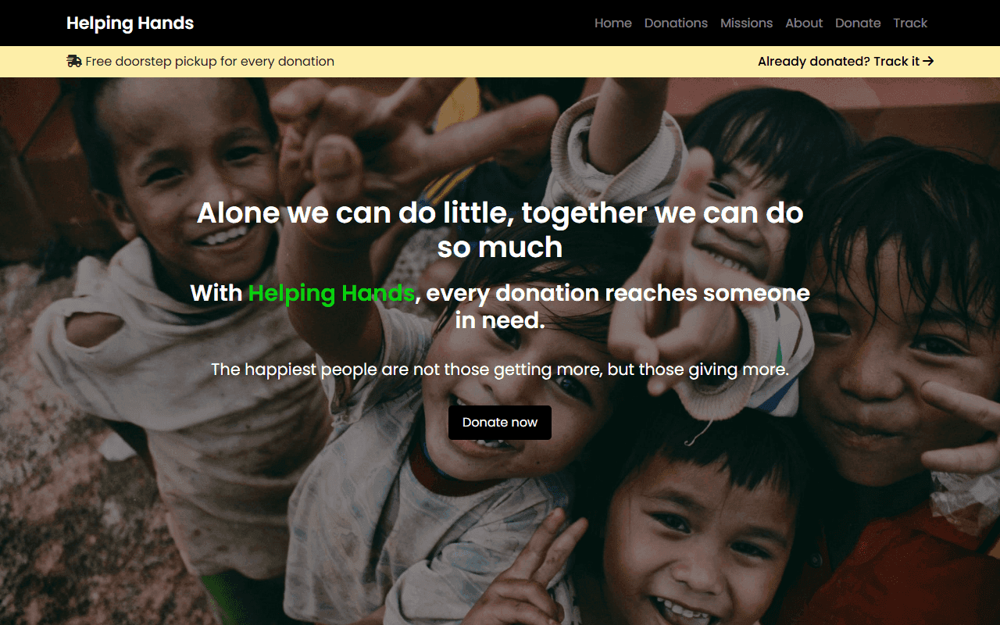
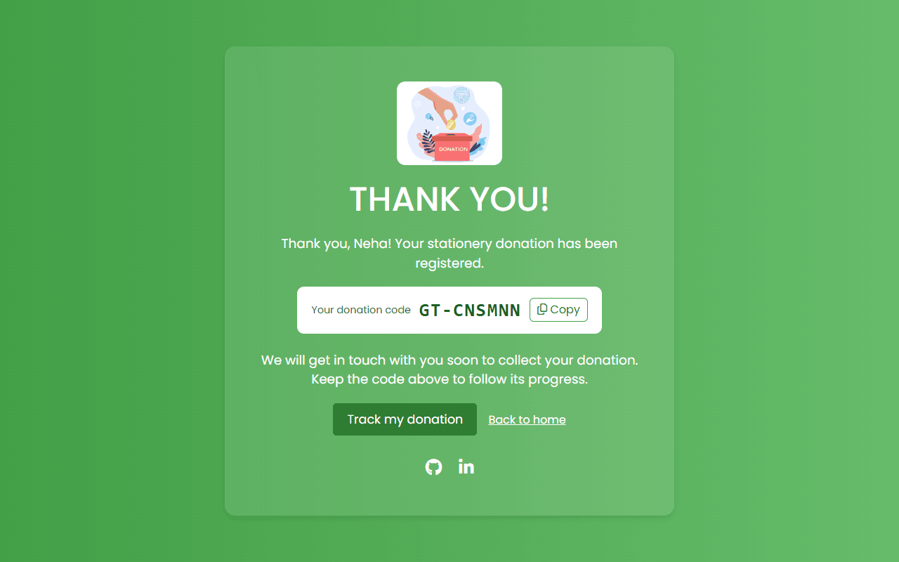
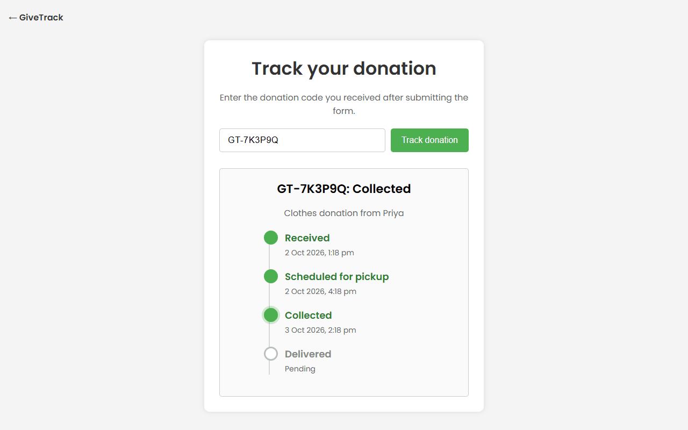
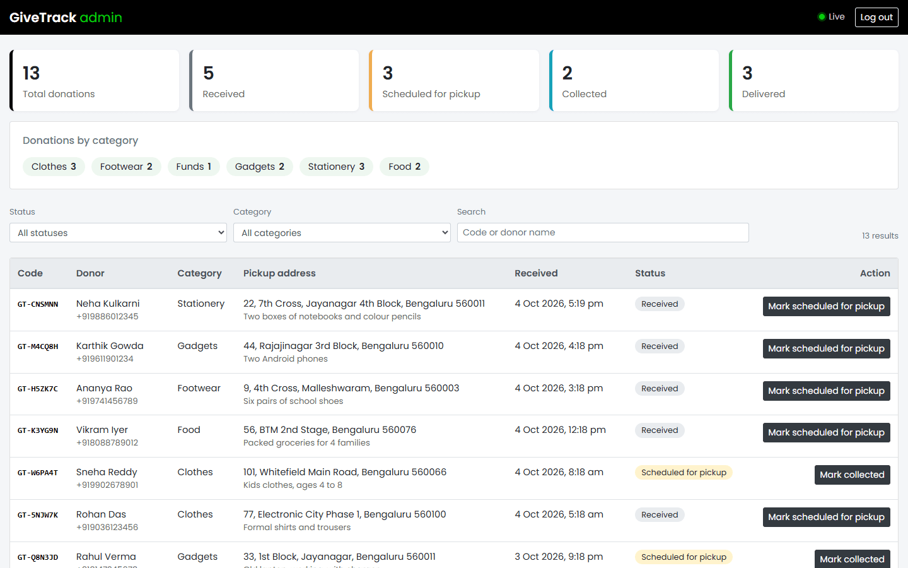
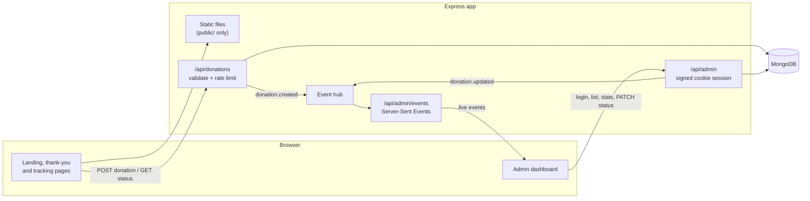

# GiveTrack

Doorstep donation pickup with a tracking code for every gift, and a live dashboard for the team that collects them.

[](https://github.com/Raja9964/GiveTrack/actions/workflows/ci.yml)

| Landing page | Thank-you page with code |
| --- | --- |
|  |  |
| **Public tracking page** | **Admin dashboard** |
|  |  |

## Features

- **Donation form** with server-side validation (trimmed input, length limits, Indian mobile numbers, fixed category list). Errors show inline next to each field.
- **Donation codes** like `GT-7K3P9Q`, built from an alphabet without look-alike characters (no `0/O`, `1/I/L`) so they are easy to read out over the phone.
- **Public tracking page**: a status timeline (Received, Scheduled for pickup, Collected, Delivered) with timestamps. It shows only the donor's first name and the category, never the phone number or address.
- **Admin dashboard** behind a password: filter and search donations, move them to the next status, and see counts by status and category.
- **Live updates**: the dashboard listens on a Server-Sent Events stream, so new donations and status changes appear without a reload.
- **Rate limiting** on donation submissions, tracking lookups and admin logins.
- **No-install demo**: `npm run dev:memory` starts the app with an in-memory MongoDB and seeded demo data.

## Tech stack

| Layer | Tools |
| --- | --- |
| Backend | Node.js 22+, Express 5, Mongoose 9, Zod, Helmet, express-rate-limit, cookie-parser |
| Database | MongoDB (mongodb-memory-server for local demo and tests) |
| Frontend | HTML, CSS, Bootstrap 4 (CSS only), vanilla JavaScript modules |
| Tooling | Vitest, Supertest, ESLint, sharp, GitHub Actions |

## Architecture



Routes stay thin: they validate input with Zod, call a service in `src/services`, and shape the response through an explicit view (`toPublicView` or `toAdminView`). The public view is an allow-list, so a new field on the model stays private unless someone adds it on purpose.

## Project structure

```
.
├── public/                 static site (the only folder served over HTTP)
│   ├── index.html          landing page and donation form
│   ├── thank-you.html      confirmation with the donation code
│   ├── track.html          public status timeline
│   ├── admin.html          admin dashboard
│   ├── css/  js/  img/
├── src/
│   ├── index.js            entry point: load config, start server, handle signals
│   ├── server.js           connect to MongoDB, build indexes, then listen
│   ├── app.js              Express app: security headers, static files, routes
│   ├── config.js           environment variables, validated with Zod
│   ├── domain.js           categories and the status flow
│   ├── validation.js       request schemas
│   ├── models/             Mongoose model
│   ├── services/           donation logic and response views
│   ├── routes/             public, admin and live-event routes
│   ├── middleware/         validation, rate limiting, admin session, errors
│   └── lib/                donation codes, event hub, HttpError
├── scripts/
│   ├── dev-memory.js       run with an in-memory MongoDB and demo data
│   ├── demo-data.js        seed donations
│   └── optimize-images.js  resize and compress images with sharp
├── test/                   Vitest + Supertest suites
└── .github/workflows/ci.yml
```

## Getting started

Requires Node.js 22.9 or newer.

### Quick demo (no MongoDB needed)

```bash
git clone https://github.com/Raja9964/GiveTrack.git
cd GiveTrack
npm install
npm run dev:memory
```

Then open:

- http://localhost:3000 for the site
- http://localhost:3000/track?code=GT-7K3P9Q for a seeded donation
- http://localhost:3000/admin with the password `givetrack-demo`

The in-memory database is wiped when the process stops. Set `PORT` to use another port.

### With your own MongoDB

```bash
cp .env.example .env    # then set ADMIN_PASSWORD and SESSION_SECRET
npm start               # or: npm run dev (restarts on file changes)
```

The server connects to MongoDB first (retrying a few times) and only starts listening once the database is ready. It refuses to start if `ADMIN_PASSWORD` or `SESSION_SECRET` is missing.

## Configuration

| Variable | Required | Default | Description |
| --- | --- | --- | --- |
| `MONGODB_URI` | no | `mongodb://127.0.0.1:27017/givetrack` | MongoDB connection string |
| `PORT` | no | `3000` | HTTP port |
| `ADMIN_PASSWORD` | yes | none | Password for `/admin`, at least 8 characters |
| `SESSION_SECRET` | yes | none | Key for signing the admin cookie, at least 32 characters |
| `NODE_ENV` | no | `development` | `production` turns on secure cookies and static caching |
| `TRUST_PROXY` | no | `0` | Number of reverse proxies in front of the app, so rate limits see the real client IP |

`dev:memory` fills in `MONGODB_URI`, a demo `ADMIN_PASSWORD` and a random `SESSION_SECRET` if they are not set.

## API reference

| Method | Path | Auth | Description |
| --- | --- | --- | --- |
| `POST` | `/api/donations` | none | Create a donation. Body: `name`, `phone`, `category`, `address`, optional `notes`. Returns `201` with `{ code, firstName }` |
| `GET` | `/api/donations/:code` | none | Public status timeline. Accepts `gt-7k3p9q`, `GT7K3P9Q` or `7K3P9Q` |
| `POST` | `/api/admin/login` | none | Body `{ password }`. Sets the session cookie and returns `204` |
| `POST` | `/api/admin/logout` | none | Clears the session cookie |
| `GET` | `/api/admin/session` | none | `{ authenticated: boolean }` |
| `GET` | `/api/admin/donations` | admin | List with `status`, `category`, `q` (code or name), `page`, `limit` (max 100) |
| `PATCH` | `/api/admin/donations/:code/status` | admin | Body `{ status }`. Moves to the next status only; `409` if it would skip or repeat a step |
| `GET` | `/api/admin/stats` | admin | Totals by status and by category |
| `GET` | `/api/admin/events` | admin | Server-Sent Events: `donation.created`, `donation.updated` |

Errors are JSON: `{ "error": "message", "details": [{ "field": "phone", "message": "..." }] }`.

Categories: `clothes`, `footwear`, `funds`, `gadgets`, `stationery`, `food`.

## Security notes

- Only `public/` is served, with dotfiles denied. Source files, `.env` and `.git` are not reachable.
- The tracking endpoint returns an allow-listed view: code, first name, category and timeline. Phone, address, notes and database IDs never leave the admin API. A test checks this.
- Admin sessions are a signed (HMAC), `HttpOnly`, `SameSite=Strict` cookie scoped to `/api/admin`, valid for 8 hours and `Secure` in production. The password check is constant-time.
- Sessions are stateless, so logging out clears the cookie but cannot revoke a copied one before it expires. Rotating `SESSION_SECRET` ends every session.
- The API accepts JSON only and the session cookie is `SameSite=Strict`, which together block cross-site form posts.
- Helmet sets a Content Security Policy with `script-src 'self'`: no inline scripts and no third-party JavaScript. Pages render user data with `textContent`, never `innerHTML`.
- Status changes are a single conditional update (`{ code, status: previous }`), so two admins clicking at once cannot skip or double-apply a step.
- Logs record method, path, status and timing only. Request bodies, with names and phone numbers, are never logged.
- Rate limits: 10 donations per 15 minutes, 60 lookups per minute and 10 failed logins per 15 minutes, per IP.
- The live feed uses an in-process event hub. Running several instances would need a shared channel such as Redis or MongoDB change streams.

## Testing

```bash
npm test        # Vitest + Supertest against an in-memory MongoDB
npm run lint    # ESLint
```

The suites cover input validation, code generation and collisions, tracking without personal data, admin authentication (wrong password, forged or expired cookies, logout, login rate limit), status updates (including simultaneous updates), the live event stream, and that server files are not exposed. CI runs lint and tests on Node 22 and 24.

To recompress images after adding new ones, run `npm run images:optimize`.

## License

[MIT](LICENSE) © 2026 Raja Mohamad
